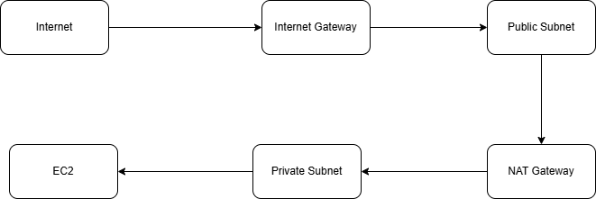

# AWS-VPC-Creation
Created a VPC in the production environment in AWS

# AWS VPC Production Setup with Public and Private Subnets

## 📝 Project Summary
- **Environment:** Production-grade
- **Tools Used:** AWS Console, EC2, ALB, VPC, Auto Scaling, Security Groups

## 🌐 Architecture Overview
### VPC
- Custom CIDR block: `10.0.0.0/16`
- DNS hostname and resolution enabled

  

### Subnets
- **Public Subnets:** For NAT Gateways and Load Balancers
- **Private Subnets:** For EC2 instances in Auto Scaling Group

### Networking Components
- Internet Gateway
- Route Tables (Public with IGW route, Private with NAT route)

### NAT Gateway
- Deployed in each public subnet
- Enables secure outbound access from private subnets

### Bastion Host
- Located in public subnet
- SSH access to private EC2 instances via trusted IPs

### Security Groups
- Bastion Host SG: SSH from trusted IP
- ALB SG: HTTP/HTTPS traffic
- EC2 SG: Only ALB and Bastion access

### Application Load Balancer (ALB)
- Public-facing ALB in public subnets
- Target group: EC2s in private subnets
- Health checks enabled

### Auto Scaling Group (ASG)
- Launch Template with EC2 config
- Scaling policies configured

## 🔒 Security Strategy
- Bastion host IP restrictions
- No public access to EC2
- NAT-secured routing
- Principle of least privilege used

## ✅ Testing
- SSH via Bastion: ✅
- ALB DNS serving app: ✅
- Auto Scaling verified: ✅
- SG rules validated

## Architecture Diagram

## 🔗 Sample URL
`aws-prod-lb-360951208.ap-south-1.elb.amazonaws.com` (Used for Calculator app demo)

